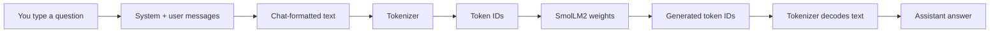

# Running and Prompting the Hugging Face Model Manually

This guide explains what happens when this lab loads a model from Hugging
Face, where the files are stored, and how to ask the model a question without
running one of the lab scripts.

It is written for beginners. You do not need to understand model training to
follow it.

## The short version

This lab uses:

```text
HuggingFaceTB/SmolLM2-135M-Instruct
```

That name identifies a model repository on the Hugging Face Hub. The first
time Python loads it, Transformers downloads the model files and tokenizer to
your computer. Later runs normally use the local cache instead of downloading
the files again.

The model does not read a Python variable called `system_prompt` or
`user_message`. It receives a sequence of tokens. Your instructions must be
turned into text with the model's chat markers, tokenized into numbers, and
then passed to the neural network.



If Mermaid diagrams are not rendered by your Markdown viewer, the same flow is:

```text
your question
    ↓
system instructions + user message
    ↓
chat-formatted text
    ↓
tokenizer: text → numbers
    ↓
model weights: numbers → next-token predictions
    ↓
tokenizer: numbers → answer text
```

## What is downloaded?

The model repository contains several kinds of files:

| File | Purpose |
| --- | --- |
| `model.safetensors` | The learned neural-network weights. This is the large file. |
| `config.json` | Describes the model architecture, such as its layers and vocabulary size. |
| `tokenizer.json` | Rules for converting text into token IDs and back. |
| `tokenizer_config.json` | Tokenizer settings and chat-template configuration. |
| `vocab.json` and `merges.txt` | Vocabulary data used by this tokenizer. |
| `special_tokens_map.json` | Defines special tokens such as end-of-sequence markers. |
| `generation_config.json` | Default generation-related settings. |

The weights are not a database of ready-made answers. They are numerical
parameters learned during training. When you prompt the model, it predicts
one token at a time. The answer is produced from those predictions and the
tokens already in the prompt.

## Where the base model is saved

`from_pretrained("HuggingFaceTB/SmolLM2-135M-Instruct")` uses the Hugging Face
Hub cache. Unless you configure another location, the cache is normally:

```text
~/.cache/huggingface/hub/
```

For this lab, the model appears under:

```text
~/.cache/huggingface/hub/
└── models--HuggingFaceTB--SmolLM2-135M-Instruct/
    ├── blobs/
    ├── refs/main
    └── snapshots/<revision-id>/
        ├── config.json
        ├── generation_config.json
        ├── model.safetensors
        ├── tokenizer.json
        ├── tokenizer_config.json
        ├── vocab.json
        └── merges.txt
```

The folder name uses `--` in place of the slash in the Hub name:
`HuggingFaceTB/SmolLM2-135M-Instruct` becomes
`models--HuggingFaceTB--SmolLM2-135M-Instruct`.

Hugging Face keeps the real file contents in `blobs/`. The files in a
`snapshots/<revision-id>/` directory commonly point to those blobs using
symbolic links. This avoids storing duplicate copies when two revisions share
the same file.

To find the cache location on your own computer, run:

```bash
python -c "from huggingface_hub import constants; print(constants.HUGGINGFACE_HUB_CACHE)"
```

You can choose a different cache location before starting Python:

```bash
export HF_HOME=/path/with/more/space/huggingface
```

The model is downloaded the first time it is needed. If the cache is deleted,
the next `from_pretrained(...)` call downloads it again. The cache is not part
of this Git repository and should not be committed.

## Where this lab saves its fine-tuned files

The base model remains in the Hugging Face cache. Task 4 does not replace the
base model. It trains a small LoRA adapter and saves it in the repository:

```text
fine-tuning-llms/
├── lora_output/       # Trainer checkpoints and training output
└── lora_adapter/      # Adapter used by Task 5
    ├── adapter_config.json
    ├── adapter_model.safetensors
    ├── chat_template.jinja
    └── tokenizer files
```

`adapter_model.safetensors` contains the learned LoRA changes. It is much
smaller than a complete copy of the base model. To use the fine-tuned model,
Python loads the base model from the Hugging Face cache and then applies the
adapter from `lora_adapter/`:

```text
base model from Hugging Face cache
                +
LoRA adapter from ./lora_adapter/
                ↓
        fine-tuned model in memory
```

The repository's rerunnable tasks preserve older generated outputs in
timestamped directories under `backups/`. Those generated directories are
ignored by Git.

## Where the prompt lives

There are three places to distinguish:

1. The prompt text exists temporarily in Python memory while the program is
   running.
2. The tokenizer converts it to token IDs in memory.
3. The generated answer exists in memory and is printed unless the program
   explicitly saves it.

Task 1 builds a prompt in this format:

```text
<|im_start|>system
You are TacoBot, a friendly taco restaurant assistant. You MUST always respond in valid JSON format...
<|im_end|>
<|im_start|>user
What's your most popular item?
<|im_end|>
<|im_start|>assistant
```

The final assistant marker tells an instruction-tuned model that it is now
the assistant's turn to continue the conversation. The prompt itself is not
saved as a model file and does not change the model weights. It disappears
when the Python process exits unless you save it yourself.

Training examples are different: they are saved in
`data/training_data.jsonl`, and preference examples are saved in
`data/preference_pairs.json`. Those files provide data for later training;
they are not the live prompt sent during inference.

## Manual setup

Activate the lab environment from the repository root:

```bash
source .venv/bin/activate
```

If the environment does not exist yet, follow the setup instructions in the
main [README](../README.md), or run:

```bash
python run_all_tasks.py
```

The all-tasks runner creates the environment and installs the required
packages. You can then use the interactive examples below.

## Manual example 1: prompt the base model in Python

Start the Python interpreter:

```bash
python
```

Enter the following lines at the `>>>` prompt. The first load may take time
because it downloads the model. The model in this lab is small enough to run
on a CPU, although generation is usually faster on a compatible GPU.

```python
import torch
from transformers import AutoTokenizer, AutoModelForCausalLM

model_name = "HuggingFaceTB/SmolLM2-135M-Instruct"
tokenizer = AutoTokenizer.from_pretrained(model_name)
model = AutoModelForCausalLM.from_pretrained(model_name, dtype=torch.float32)

device = "cuda" if torch.cuda.is_available() else "cpu"
model = model.to(device)
model.eval()

system_prompt = "You are TacoBot, a friendly taco restaurant assistant."
user_message = "What is your best seller?"
prompt = (
    "<|im_start|>system\n" + system_prompt +
    "\n<|im_end|>\n<|im_start|>user\n" + user_message +
    "\n<|im_end|>\n<|im_start|>assistant\n"
)

inputs = tokenizer(prompt, return_tensors="pt").to(device)
with torch.no_grad():
    output_ids = model.generate(
        **inputs,
        max_new_tokens=80,
        do_sample=True,
        temperature=0.7,
        pad_token_id=tokenizer.eos_token_id,
    )

new_tokens = output_ids[0][inputs["input_ids"].shape[1]:]
answer = tokenizer.decode(new_tokens, skip_special_tokens=True)
print(answer)
```

To leave the Python interpreter, type:

```python
exit()
```

### What each important line does

- `AutoTokenizer.from_pretrained(...)` loads the text-to-token converter,
  using the local cache after the first download.
- `AutoModelForCausalLM.from_pretrained(...)` loads the causal language model
  weights.
- `tokenizer(prompt, return_tensors="pt")` converts the prompt to PyTorch
  tensors.
- `model.generate(...)` repeatedly predicts the next token.
- Slicing with `inputs["input_ids"].shape[1]:` removes the original prompt so
  only newly generated text is printed.
- `tokenizer.decode(...)` converts generated token IDs back into readable
  text.

## Manual example 2: use the tokenizer's chat template

Many instruction models provide a chat template. It is safer to use the
template when it is available because it knows the model's required special
markers:

```python
messages = [
    {"role": "system", "content": "You are TacoBot, a friendly taco restaurant assistant."},
    {"role": "user", "content": "What is your best seller?"},
]

prompt = tokenizer.apply_chat_template(
    messages,
    tokenize=False,
    add_generation_prompt=True,
)
inputs = tokenizer(prompt, return_tensors="pt").to(device)

with torch.no_grad():
    output_ids = model.generate(
        **inputs,
        max_new_tokens=80,
        do_sample=True,
        temperature=0.7,
        pad_token_id=tokenizer.eos_token_id,
    )

new_tokens = output_ids[0][inputs["input_ids"].shape[1]:]
print(tokenizer.decode(new_tokens, skip_special_tokens=True))
```

`add_generation_prompt=True` adds the marker that means “the assistant
should answer now.” If `apply_chat_template` is unavailable for another model,
use that model's documentation to learn its prompt format. Chat markers are
model-specific; copying SmolLM2's markers blindly to a different model may
produce poor results.

## Manual example 3: prompt the fine-tuned adapter

Run Task 4 first so that `lora_adapter/` exists. Then, in a new Python
interpreter or the same one after loading the base model, run:

```python
from peft import PeftModel

adapter_path = "./lora_adapter"
fine_tuned_model = PeftModel.from_pretrained(model, adapter_path)
fine_tuned_model = fine_tuned_model.to(device)
fine_tuned_model.eval()

user_message = "Do you have a chicken taco combo?"
prompt = (
    "<|im_start|>system\n" + system_prompt +
    "\n<|im_end|>\n<|im_start|>user\n" + user_message +
    "\n<|im_end|>\n<|im_start|>assistant\n"
)
inputs = tokenizer(prompt, return_tensors="pt").to(device)

with torch.no_grad():
    output_ids = fine_tuned_model.generate(
        **inputs,
        max_new_tokens=80,
        do_sample=True,
        temperature=0.7,
        pad_token_id=tokenizer.eos_token_id,
    )

new_tokens = output_ids[0][inputs["input_ids"].shape[1]:]
print(tokenizer.decode(new_tokens, skip_special_tokens=True))
```

The adapter is not useful by itself: it depends on the same base model
architecture and base weights. This is why the code loads `model` first and
then wraps it with `PeftModel.from_pretrained(...)`.

## Manual prompting versus the lab scripts

The manual examples and the lab scripts use the same basic pipeline:

```text
load tokenizer → load base model → build prompt → tokenize
→ generate → decode → inspect answer
```

The scripts add repeatability and evaluation around that pipeline. For
example:

- Task 1 compares ordinary prompts with jailbreak prompts.
- Task 4 trains and saves the LoRA adapter.
- Task 5 compares the base model with the adapter and saves a report under
  `results/task5/`.

Manual prompting is useful for learning and quick experiments. It does not
automatically create completion markers, backup old outputs, or save result
reports.

## Common beginner problems

### “It is downloading again”

Check that you are using the same user account and cache location. Print the
cache path with the command shown above. A different `HF_HOME` or a container
with a temporary home directory can create a second cache.

### “CUDA out of memory”

Use the CPU by setting `device = "cpu"`, reduce `max_new_tokens`, or close
other GPU applications. This lab's base model can run on a CPU.

### “No such file or directory: lora_adapter”

The adapter has not been created yet. Run Tasks 3 and 4, or run the complete
pipeline with `python run_all_tasks.py`.

### The response includes the prompt

Decode only the new tokens, as the examples do. The generated sequence often
contains the original input followed by the new answer.

### The response is inconsistent

With `do_sample=True`, generation is intentionally random. Set
`do_sample=False` for a more repeatable response, or set a random seed. A
prompt is also an instruction, not a guarantee: Task 1 demonstrates why a
system prompt alone cannot enforce behavior perfectly.

## A useful mental model

Think of the model as a calculator for language:

```text
model files on disk
        ↓ loaded into memory
model weights + tokenizer
        ↓ combined with your prompt
next-token predictions
        ↓ repeated many times
generated answer
```

The files on disk provide the learned capability. The prompt provides the
current context. The tokenizer connects human-readable text to the numerical
representation the model understands. None of these three pieces should be
confused with the others.
